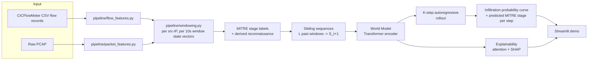

# Architecture

## System overview

## 1. Network state representation

Network state is a per-**source-IP**, per-**10-second-window** feature vector combining:

- **Flow-level** (from CICFlowMeter CSVs): flow count, unique destination ports/IPs, total
  bytes/packets, mean duration, SYN/ACK/FIN/RST/PSH/URG flag ratios, IAT mean/variance/max,
  bidirectional flow ratio, TCP/UDP ratio.
- **Packet-level** (from PCAP via Scapy, optional): TTL mean/variance, mean TCP window size,
  IP-fragment ratio, payload size mean/std, a port-scan signature score (unique destination ports
  touched per packet — near 1.0 for a scan, near 0 for a normal sustained conversation), and a
  retransmission ratio (duplicate `(src, dst, port, seq)` tuples).

Flow-level features capture aggregate behaviour (a SYN flood); packet-level features expose the
timing/sequencing a flow-level view smooths over (a slow scan designed to stay under flow-based
thresholds). When no PCAP is available for a capture window, packet-level features are zero-filled
rather than dropping the window — the model still gets the flow-level signal.

Per `pipeline/windowing.py`, a window's ground-truth label is the majority **non-benign** flow
label within it (so one attack flow amid many benign ones still marks the window as an attack —
rare events must not get diluted away by volume).

## 2. World model — Transformer, not GNN or plain LSTM

`models/world_model.py`. Input: `L=12` consecutive window state vectors (2 minutes of context at
10s windows). A learned linear projection + sinusoidal positional encoding feeds a stack of
Transformer encoder layers (self-attention implemented explicitly rather than via
`nn.TransformerEncoderLayer`, specifically so attention weights can be extracted for
explainability). The representation at the final time step — after attending over the whole
window — feeds three heads:

- **Next-state regression** (`S_t+1`, MSE loss) — the actual world-model dynamics objective.
- **MITRE-stage classification** (cross-entropy, 6-way: benign + 5 stages) for the immediate next
  step, masked out on windows whose true label maps to `impact` (DoS/DDoS — not one of the five
  requested stages; see `docs/03-mitre-mapping.md`).
- **Infiltration probability** (binary cross-entropy) for the immediate next step.

This is trained via **supervised dynamics learning**: ground-truth transitions come directly from
the dataset's attack-timeline labels, exactly as the problem statement specifies.

**Why Transformer over LSTM/GNN**: the problem statement accepts any of the three. A Transformer
was chosen because (a) self-attention gives temporal explainability natively — which past windows
mattered — satisfying the explainability requirement without a bolted-on mechanism, and (b) a GNN
requires constructing and maintaining a host-interaction graph per window, which is meaningfully
more implementation risk than the timeline supports well. A GNN variant (nodes = hosts, edges =
flows within a window) is a natural extension and is left for future work rather than attempted
under time pressure.

## 3. K-step forecasting — the actual "world model" behaviour

`models/train.py` only ever trains a **single-step** (`t -> t+1`) predictor. `models/forecast.py`
turns that into the K-step rollout the problem statement asks for: feed the current `L`-window
history in, take the predicted next state, drop the oldest window, append the prediction, repeat
`K=6` times (1 minute ahead at 10s windows). Each step yields an infiltration probability, a
predicted MITRE stage, and the attention pattern that produced it — a full trajectory, not a
single score. This autoregressive rollout, not the training objective, is what makes the system a
world model rather than a one-shot classifier.

## 4. Explainability — three views, plus two unsupervised signals

- **Attention** (`summarize_attention`): which past windows drove a prediction — free, no extra training.
- **Gradient x input** (`gradient_input_attribution`): instant, one backward pass, local approximation.
- **SHAP** (`ShapExplainer`): `KernelExplainer` on the current window against the preceding `L-1`
  windows held fixed — slower, sampled rather than a local approximation, no saturated-gradient blind spot.

All three explain the *same* prediction and are surfaced together in the demo — never a bare
probability. Two further, label-free signals: **predicted state delta** (`ForecastResult.state_deltas`,
raw-unit "what's about to change") and **novelty** (`one_step_reconstruction_error`: how far the
model's prediction for the most recently *observed* window was from what actually happened — a
genuine ground-truth anomaly signal, unlike `transition_magnitude`'s size-of-imagined-jump, which
has no ground truth to check against yet). `rollout_with_uncertainty` (MC-dropout over `n_samples`
stochastic rollouts) gives a 10th/50th/90th percentile band around the forecast, shown in the demo.

## 5. Baselines and evaluation

Three baselines in `models/baseline_lr.py`, each isolating a different question:

- **LR, last window**: current window only — the "classify each flow in isolation" approach the
  problem statement contrasts world models against.
- **LR, stacked window**: the *same* `L`-window history the world model sees, flattened for a
  non-sequential classifier — isolates "does sequential structure help, or would the same columns
  fed flat do just as well," a stronger claim than the last-window comparison alone.
- **Persistence**: no learning — current state persists unchanged. If the world model can't beat
  this, it isn't learning real dynamics.

`eval/benchmark.py` compares all four at two operating points: default 0.5, and a fixed 5%
false-positive-rate budget (threshold picked on **val**, applied to test) — how a defender actually
tunes such a system. `docs/04-evaluation.md` includes a computed honesty check: if the stacked
baseline ties or beats the world model, the report says so rather than only showing favourable numbers.

**Evaluation pitfalls are treated as a design constraint.** Arp et al., *"Dos and Don'ts of Machine
Learning in Computer Security"* (USENIX Security 2022), catalogues the failure modes that inflate
published security-ML results. This project's audit (`docs/AUDIT.md`) hit three and records the
fixes: **data snooping** (E1, §6), **base-rate fallacy** — a 5%-FPR budget is meaningless at 0.8%
prevalence, so 1%/0.1% budgets and threshold-free AUPRC were added (E5) — and **inappropriate
baselines**: persistence and Markov read the current window's true label and are now labelled
oracles, with a deployable counterpart alongside (E6).

## 6. Known limitations

Measured, not estimated; evidence and finding IDs in `docs/AUDIT.md`.

- **Generalisation is the honest weak point.** Day-disjoint, the model scores F1 0.370 / AUROC 0.706
  (t+1, 7,191 real test sequences). The earlier 0.917 came from a per-host split that shared attack
  sessions between train and test (E1) — data snooping, found by audit and corrected.
  Leave-one-attack-family-out is negative for three of four families (AUROC 0.612 / 0.432 / 0.531)
  and positive only for DDoS (0.872); zero-shot transfer to CTU-13 is chance (0.517). No claim is
  made to generalise to unseen attacks — the claim is that this was measured and published.
- **The data sets that ceiling.** Nine of ten CIC-IDS-2018 days ship without Src/Dst IP and collapse
  to one pseudo-host per day; the only day with real per-host structure is DDoS, and the three
  families LOFO fails on are exactly those without per-host data. CIC-IDS-2017, which keeps the
  5-tuple every day, is the next step.
- **Packet features are implemented but zero-filled in both shipped checkpoints** (no CIC-IDS-2018
  PCAP: 37 GB/day). A PCAP-only path exists and is unit-matched to the CSV path, but flow-only
  training makes `reconnaissance` unreachable at inference, since it keys on a packet-level
  port-scan score. `exfiltration` exists only as a synthetic, demo-only label, captioned as such.
- **MITRE stage labels are a documented heuristic mapping** (`docs/03-mitre-mapping.md`), not ground
  truth; DoS/DDoS maps to `impact`, outside the five-stage task.
- **Adversarial evasion succeeds and is unfixed**: a white-box PGD attack suppressing volume
  features drives t+1 infiltration probability from 0.9975 to 0.0000. Threat model stated rather
  than hidden — it requires the attacker to send genuinely less traffic, which defeats a flood but
  is realistic for low-and-slow intrusion.
- **Operating points do not transfer across days**: a 5%-FPR budget tuned on validation yields ~36%
  FPR on test, so every budgeted number carries its achieved FPR.
- **Architecture alternatives.** A GNN was built and ablated — no measurable benefit
  (`docs/06-gnn-ablation.md`). An RSSM (Dreamer-style latent dynamics) remains more faithful to the
  world-model literature and was not attempted, for timeline reasons.
