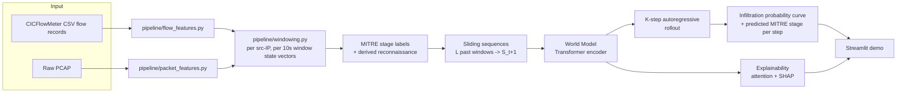

# Architecture

## System overview

## 1. Network state representation

Network state is a per-**source-IP**, per-**10-second-window** feature vector combining:

- **Flow-level** (from CICFlowMeter CSVs): flow count, unique destination ports/IPs, total
  bytes/packets, mean duration, SYN/ACK/FIN/RST/PSH/URG flag ratios, IAT mean/variance/max,
  bidirectional flow ratio, TCP/UDP ratio.
- **Packet-level** (from PCAP via Scapy, optional): TTL mean/variance, mean TCP window size,
  IP-fragment ratio, payload size mean/std, a port-scan signature score (unique destination ports
  touched per packet — near 1.0 for a scan, near 0 for a normal sustained conversation), and a
  retransmission ratio (duplicate `(src, dst, port, seq)` tuples).

Flow-level features capture aggregate behaviour (a SYN flood); packet-level features expose the
timing/sequencing a flow-level view smooths over (a slow scan designed to stay under flow-based
thresholds). When no PCAP is available for a capture window, packet-level features are zero-filled
rather than dropping the window — the model still gets the flow-level signal.

Per `pipeline/windowing.py`, a window's ground-truth label is the majority **non-benign** flow
label within it (so one attack flow amid many benign ones still marks the window as an attack —
rare events must not get diluted away by volume).

## 2. World model — Transformer, not GNN or plain LSTM

`models/world_model.py`. Input: `L=12` consecutive window state vectors (2 minutes of context at
10s windows). A learned linear projection + sinusoidal positional encoding feeds a stack of
Transformer encoder layers (self-attention implemented explicitly rather than via
`nn.TransformerEncoderLayer`, specifically so attention weights can be extracted for
explainability). The representation at the final time step — after attending over the whole
window — feeds three heads:

- **Next-state regression** (`S_t+1`, MSE loss) — the actual world-model dynamics objective.
- **MITRE-stage classification** (cross-entropy, 6-way: benign + 5 stages) for the immediate next
  step, masked out on windows whose true label maps to `impact` (DoS/DDoS — not one of the five
  requested stages; see `docs/03-mitre-mapping.md`).
- **Infiltration probability** (binary cross-entropy) for the immediate next step.

This is trained via **supervised dynamics learning**: ground-truth transitions come directly from
the dataset's attack-timeline labels, exactly as the problem statement specifies.

**Why Transformer over LSTM/GNN**: the problem statement accepts any of the three. A Transformer
was chosen because (a) self-attention gives temporal explainability natively — which past windows
mattered — satisfying the explainability requirement without a bolted-on mechanism, and (b) a GNN
requires constructing and maintaining a host-interaction graph per window, which is meaningfully
more implementation risk than the timeline supports well. A GNN variant (nodes = hosts, edges =
flows within a window) is a natural extension and is left for future work rather than attempted
under time pressure.

## 3. K-step forecasting — the actual "world model" behaviour

`models/train.py` only ever trains a **single-step** (`t -> t+1`) predictor. `models/forecast.py`
turns that into the K-step rollout the problem statement asks for: feed the current `L`-window
history in, take the predicted next state, drop the oldest window, append the prediction, repeat
`K=6` times (1 minute ahead at 10s windows). Each step yields an infiltration probability, a
predicted MITRE stage, and the attention pattern that produced it — a full trajectory, not a
single score. This autoregressive rollout, not the training objective, is what makes the system a
world model rather than a one-shot classifier.

## 4. Explainability — two complementary views

- **Attention** (`models/explain.py::summarize_attention`): which past time windows the model
  relied on for a given prediction — free from the architecture, no extra training.
- **SHAP** (`models/explain.py::ShapExplainer`): `KernelExplainer` over the *current* window's
  feature vector against the infiltration-probability output, holding the preceding `L-1` windows
  of real history fixed. This isolates which specific flags, ports, or flow statistics are driving
  the score for *this* snapshot, rather than conflating it with the trajectory that led here.

Both are wired directly into the forecast output and surfaced in the demo — never a bare
probability with no explanation attached.

## 5. Baseline and evaluation

`models/baseline_lr.py`: logistic regression predicting the same immediate-next-step targets from
only the *current* window's feature vector — no sequence, no temporal context. This is
deliberately the "traditional classifier treats each flow in isolation" approach the problem
statement contrasts world models against. `eval/benchmark.py` compares F1/precision/recall/FPR
(infiltration) and macro F1/precision/recall (MITRE stage) between the two on an identical held-out
test set; results are written to `docs/04-evaluation.md`.

## 6. Known limitations

- MITRE stage labels for CIC-IDS-2018 are a documented heuristic mapping (`docs/03-mitre-mapping.md`),
  not ground truth the dataset provides directly.
- `reconnaissance` has no direct CIC-IDS-2018 label; it's derived from benign windows with a high
  port-scan score immediately preceding an attack from the same source IP.
- Currently validated end-to-end on a synthetic traffic sample; real CIC-IDS-2018 training is the
  next step (`docs/02-dataset-and-features.md`).
