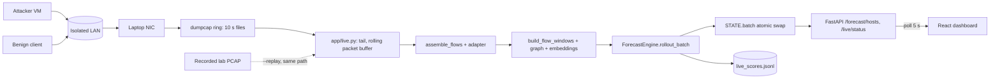

# 07 - Live log feed, live attack demo, and old-laptop deployment: plan

Status: PLAN ONLY. Nothing in this document has been built or run. Written 2026-10-10 from a
read-only study of the repo. Every "exists" claim below cites a file/function that was read;
every "missing" claim was checked by reading the call sites. Items I could not verify are marked
UNVERIFIED.

Scope guard: this plan does not touch `pipeline/mitre_mapping.py` or the CTU-13 files (another
agent is editing them). Nothing below requires changing the stage mapping.

---

## 0. Read this first - what the repo actually does today, and the honest ceiling

### 0.1 Corrections to the premise

1. **The stream_consumer zero-padding bug (AUDIT H3) is already fixed.** `scripts/stream_consumer.py`
   now builds all 41 columns via `common.config.feature_columns` and calls `validate_feature_names`
   at start-up; `tests/test_stream_consumer.py` guards it (AUDIT W15 "VERIFIED"). The consumer is
   still **not fit for a live demo** for other reasons (section 0.3).
2. **The webhook service (`app/api.py`, AUDIT H1) is already hardened** (off unless
   `NAF_API_ENABLED=1`, bearer token with `hmac.compare_digest`, https-only allowlisted webhooks,
   private/link-local/loopback destinations refused). It is also **a dead end for the dashboard**:
   it keeps alerts in a process-local list (`recent_alerts`) that `app/server.py` never reads.
   Recommendation: **do not run it at all for the judges' demo.** It adds an attack surface and no
   value; the live path below goes straight into `app/server.py`'s state.
3. **There is no live path into the dashboard today.** `app/server.py::STATE` is populated only by
   `POST /api/v1/analysis/upload` (a whole file, one-shot). `Dashboard.jsx` polls every 5 s
   (`setInterval(fetchSilentUpdates, 5000)`), but what it polls is whatever the last upload left in
   `STATE.batch`. So "live" means: something must keep refreshing `STATE.windows` / `STATE.batch`.

### 0.2 The honest ceiling (the demo must say this out loud)

From README "What this system does not do" and `docs/04-evaluation-*`:

| Fact | Number | Consequence for the demo |
|---|---|---|
| Day-disjoint F1 @ 0.5 / AUROC | 0.481 +/- 0.033 / 0.794 +/- 0.043 (3 seeds, `checkpoints_real_v2_converged`) | A live attack may simply not fire. |
| Recall @ 0.5 | 0.325 | Two of three attack windows go unflagged. |
| Lead time | -0.5 s mean, 0 s median; 93.5% of 628 transitions missed | **The model does not give advance warning.** It alarms at onset. Do not promise "warning before the attack" on stage. |
| 60 s rollout vs holding t+1 | AUROC 0.755 vs 0.785 at t+60 s | Present the rollout as a *trajectory/what-if view*, not as a better predictor. |
| Zero-shot CTU-13 / UNSW | AUROC 0.517 / 0.424 | Anything not shaped like CIC-IDS-2018 is a coin flip. |
| Leave-one-family-out | 0.53-0.82 AUROC; only DoS ("impact") is above chance, marginally | Brute force / C2 / lateral movement on a *new* network are unproven. |

Therefore the demo is designed as: **(a) a real live pipeline that is correct end-to-end, (b) lab
traffic deliberately shaped like the training distribution, (c) thresholds recalibrated on that lab
traffic, (d) a labelled replay fallback, (e) a limitations segment spoken by the presenter.** It
must never be presented as evidence of generalisation.

### 0.3 Defects in the existing code that would make a live demo misleading (fix BEFORE anything else)

| ID | Defect | Where | Why it misleads |
|---|---|---|---|
| D1 | **Observed stage reads "Benign" for any unlabelled input, including an attacker.** `load_flow_csv(require_label=False)` and `build_flow_records`/`assemble_flows` path set `label="BENIGN"`; `build_flow_windows` maps it to `stage`; `_observed_stage()` in `app/server.py` returns it with `current_stage_observed=True`. The table, forecast panel and narrative then say "currently Benign" next to a 0.9 forecast. | `app/server.py::_observed_stage`, `pipeline/flow_features.py::load_flow_csv`, `pipeline/packet_features.py::build_flow_records` | Looks like a bug or a lie to a judge. Live traffic has no ground truth, so observed stage must be reported as *unknown*. Verify first by uploading `data/raw/pcap/synthetic_sample.pcap` and reading `/api/v1/forecast/hosts`. |
| D2 | **`stream_consumer.py` builds windows per 100-row batch, not per 10-s window.** `_build_batch_windows(batch)` windows each batch independently, so one real 10-s window that straddles two batches yields two partial `(src_ip, window_start)` rows; `host_buffers` concatenates them with no dedup. `flow_count`, `total_*`, graph and embedding features are all understated. Also `time.sleep(0.5)` per batch ignores flow timestamps (fake pacing). | `scripts/stream_consumer.py::simulate_stream`, `run_consumer` | Wrong features, silently. Do not reuse this loop; replace with the time-based live module (section 1.4). |
| D3 | **Wrong defaults in consumer**: loads `configs/default.yaml` (synthetic-trained checkpoint) and `--data data/raw/synthetic_sample.csv` (the file is at `data/raw/flows/synthetic_sample.csv`). Alerts POST to an endpoint that exists only on the disabled `app/api.py`; threshold hard-coded 0.5 while the server uses 0.15 / 0.40 / 0.70 (`app/service.py::SEVERITY_LEVELS`). | `scripts/stream_consumer.py` | Alerts go nowhere; two inconsistent thresholds. Deprecate the script (keep as a documented offline example). |
| D4 | **The server serves the v1 checkpoint.** `_State.config_path = "configs/real_data.yaml"` -> `checkpoints_real` (trained on the leaky per-host split whose 0.917 F1 was withdrawn). The dataset registry offers only `real_data.yaml`, `unsw_nb15.yaml`, `ctu13.yaml`; the day-disjoint `configs/real_data_v2_converged.yaml` / `checkpoints_real_v2_converged` (the one the README headline refers to) cannot be selected. | `app/server.py::_State`, `_dataset_registry` | The metrics quoted next to the live view would belong to a different model than the one scoring. Pick one checkpoint and make the UI say which. |
| D5 | **`has_ip_data` is a provenance confound.** Live traffic always has `has_ip_data=1`. In training that value occurs only for the one per-host day (Tuesday 20-02); brute force and Bot were only ever seen as `NETWORK-<date>` aggregates (`has_ip_data=0`). `models/explain.py` already reports it as a "provenance" attribution. | `pipeline/flow_features.py::_fill_missing_ip_columns` | Expect the best-supported signal to be DoS-like volume, and everything else unproven. Calibration (section 2.6) is how this is handled honestly. |
| D6 | **Reconnaissance cannot fire on a flow-only checkpoint.** `port_scan_score` is a packet-level feature, zero-filled by the flow-only guard (`app/service.py::is_flow_only_model`), and the recon override in `models/forecast.py::_heuristic_stage_override` is additionally gated on `alert_threshold` (default 0.3). An nmap scan will show up only through `unique_dst_ports` / `flow_count` / `syn_ratio` / `rst_ratio`, or not at all. | as listed | The storyline must not claim "Reconnaissance detected" unless the lab run shows it. |
| D7 | **Impact heuristic needs real volume**: `volume_z > impact_volume_zscore (4.0)` against a scaler fit partly on network-wide daily aggregates. A gentle hping3 may never cross it. | `models/forecast.py::_heuristic_stage_override` | Calibrate the flood rate on the lab; do not assume. |
| D8 | **No CPU-only latency figure exists** (`docs/04-latency-benchmark.md` "Limitations"). `load_world_model` does fall back to CPU when CUDA is absent (`torch.device("cuda" if torch.cuda.is_available() else "cpu")`, `checkpoint_io.load_checkpoint(map_location=device)`), so the old laptop will run, but speed on it is unmeasured. | `models/forecast.py::load_world_model` | Measure before promising anything. |
| D9 | `frontend/src/api/client.js` falls back to a hard-coded token `phoenix_demo_jwt_token_2026_secured`; `server.py` auth is opt-in (`PHOENIX_REQUIRE_AUTH=1`) and its own docstring says it is off only because of this. | `frontend/src/api/client.js`, `app/server.py::_require_token` | Turning auth on today would break the UI; leaving it off means the LAN is the only protection (section 3.4). |
| D10 | No live-feed UI affordance: nothing tells the viewer whether data is LIVE, a REPLAY, or an uploaded file, how old the last window is, or which checkpoint scored it. | `frontend/src/pages/Dashboard.jsx` | A replay shown as live would be the single worst credibility failure. |

---

## 1. Question 1 - How will logs be ingested?

### 1.1 The target schema (what any ingestion path must produce)

The model consumes 41 features per (src_ip, 10-s window), 12 consecutive windows per host
(`configs/real_data_v2_converged.yaml`: `window_seconds: 10`, `sequence_length: 12`,
`forecast_horizon: 6`):

- 19 flow-level: `flow_count, unique_dst_ports, unique_dst_ips, has_ip_data, total_bytes, total_packets, mean_duration, syn/ack/fin/rst/psh/urg_ratio, mean_iat, var_iat, max_iat, bidir_ratio, tcp_ratio, udp_ratio`
- 5 graph (`graph_out_degree`, `..._fan_out_ratio`, `..._fan_in_ratio`, `..._component_size`, `..._dst_entropy`) computed across all hosts in the window
- 8 `graph_embed_*` from a frozen, fixed-seed random-init GraphSAGE (`pipeline/graph_embedding_features.py`, seeded via `GRAPH_EMBED_SEED`, so live and training embeddings agree for identical graphs - verified by reading, not by running)
- 9 packet-level, **zero-filled** for the flow-only checkpoint (`has_packet_features = 0`)

The per-flow input the windowing code needs (`pipeline/windowing.py::build_flow_windows`):
`src_ip, dst_ip, dst_port, timestamp (datetime), total_pkts, total_bytes, duration_s (SECONDS),
syn/ack/fin/rst/psh/urg_cnt, iat_mean/iat_std/iat_max (MICROSECONDS), bidir_ratio, is_tcp, is_udp,
has_ip_data, label`.

Unit traps (all already hit once, per AUDIT G4/G5/a60c549):

| Field | Required unit | Trap |
|---|---|---|
| `duration_s` | seconds (CIC `Flow Duration` is microseconds, divided by 1e6 in `clean_and_normalize`) | feeding microseconds = 1e6 too large |
| `iat_mean/std/max` | **microseconds** (CIC native, carried through unchanged) | Zeek/Suricata/Scapy give seconds or ms; AUDIT G5 was exactly this |
| `total_bytes` | L4 payload bytes (CIC `TotLen Fwd/Bwd Pkts`) | wire bytes incl. headers (NetFlow, Suricata) are larger |
| `*_cnt` flags | count of **packets** carrying the flag | NetFlow/Suricata give only the OR of flags per flow |
| `timestamp` | flow START time | exporters that emit at flow end must still stamp the start |
| packet features | must be zero for the flow-only checkpoint | feeding real packet features to a flow-only model is out of distribution (AUDIT W3 / G11) |

### 1.2 Options compared (old laptop, no GPU)

| Option | Needs | Repo support today | Missing | CPU/RAM on old laptop | Schema fit |
|---|---|---|---|---|---|
| **A. dumpcap/tshark ring buffer -> repo's fast parser -> windowing (RECOMMENDED primary)** | Wireshark's `dumpcap` + Npcap (Windows) or libpcap (Linux); NIC that sees the traffic | `pipeline/fast_packet_windows.py`: `read_all_frames` (raw frame parse with `struct`, Ethernet + Linux-SLL, IPv4 TCP/UDP) and `assemble_flows` (bidirectional 5-tuple, 120 s timeout, flag counts, IAT in **microseconds**, L4 payload bytes, `has_ip_data=1`). Same schema as CICFlowMeter by design; parity with Scapy path checked by `tests/test_fast_flows.py` (AUDIT Part H). | A rolling/incremental driver (today it is batch: `read_all_frames(path)` per file, first/last windows dropped at file edges). An adapter to the `clean_and_normalize` schema: `timestamp_s` (epoch float) -> datetime, `ip_to_str` for the uint32 IPs, add `label="BENIGN"`, `protocol` not needed (`is_tcp/is_udp` already present). Wiring to `STATE`. | dumpcap: ~1-3% of a core at lab rates, near-zero RAM (disk ring). Parsing: the file docstring says Scapy dissection is ~3,200 pkt/s/core; the "49-78x" faster-parser claim in AUDIT H is only partly verified, so **measure on the laptop** (task T9). A 1,000 pps flood x 5 min = 300k packets: too slow at Scapy's ~3,200 pkt/s (about 94 s of CPU per 5 min of flood, per tick if re-parsed), acceptable only if the fast parser really is tens of times faster and each ring file is parsed once and cached (design point of app/live.py). Memory: keep only a rolling 5-minute packet buffer. | Exact (incl. per-flag counts, IAT us) except one documented approximation: no FIN-termination flow split. |
| B. Scapy `sniff()` live | Scapy (already a dependency; GPL-2.0, see README) + Npcap | `pipeline/packet_features.py::load_pcap` / `build_flow_records` (file based, per-flow python loop - slow) | A live sniffer loop; flow assembly is O(flows) python | Packet loss under flood; Scapy ~3,200 pkt/s/core | Fits, but the 1e6 IAT trap (G5) lives here; correct only after the fix noted in the file |
| C. Original Java CICFlowMeter (live or on PCAP) -> rolling CSV | Java, Npcap/jnetpcap (fragile on Windows), writes a flow row only when the flow terminates or times out | CSV reader `pipeline/flow_features.py::load_flow_csv` already accepts its columns (`COLUMN_RENAME`) | Process supervision, tail-the-CSV driver; timestamp-format handling (`_parse_timestamp` accepts day-first slash and ISO only) | JVM 300-600 MB RAM + capture; heaviest option | Exact (it is the training tool) - but flows appear late (up to the timeout) |
| D. Zeek `conn.log` | Zeek (Linux practically; Windows unsupported) | none | Whole adapter | Moderate | **Poor**: no per-packet flag counts (only a `history` string), no IAT stats, no PSH/URG counts -> 5-8 of 19 flow features would be derived or zero = off-distribution. Not recommended. |
| E. Suricata `eve.json` (flow events) | Suricata (Linux/Windows build exists) | none | Whole adapter | Moderate-high (rules engine you don't need) | **Poor**: pkts/bytes/start/end yes; flags only as union; no IAT; bytes include headers. Same objection as D. |
| F. NetFlow/IPFIX from a router | A router/switch that exports v9/IPFIX; a collector (nfcapd / own UDP listener) | none | Collector + adapter | Low | **Poor**: no IAT, no per-flag counts, active timeouts of 60 s+ make 10-s windows meaningless. Only viable for flow_count / bytes / packets / unique ports. |
| G. Syslog / Filebeat | n/a | none | n/a | n/a | **Unusable** for this model: log lines carry no flow statistics. Mention to judges only as a SIEM *output* (alerts out), not as an input. |

### 1.3 Recommendation

- **Primary: Option A** - `dumpcap` ring buffer -> `fast_packet_windows` -> in-process live module in `app/server.py`.
  It reuses the one flow assembler that already matches CICFlowMeter's field semantics and units,
  needs no Java, and is a single extra process (`dumpcap`).
- **Fallback: replay the same PCAP through the same code path**, paced by packet timestamps
  (`scripts/live_ingest.py --replay lab_run.pcapng --speed 1`). The pipeline, UI and timings are
  identical; the UI shows a red **REPLAY** badge (D10). A second fallback is the existing Bot-day
  demo CSV (`demo/demo-capture-cicids2018-bot-02mar2018.csv`, uploaded through the existing
  `/analysis/upload`; one pseudo-host, peak ~0.9997, disclosed as such in `scripts/make_demo_capture.py`).
- Rejected: B (slow, drops packets), C (heavy, fragile on Windows, late rows), D-G (cannot
  reproduce the 41-feature schema; would silently go out of distribution).

### 1.4 Design of the live module

New code (T3): `app/live.py` (the engine) and `scripts/live_ingest.py` (CLI/replay wrapper); minimal
endpoints added to `app/server.py`.

```
 ATTACKER (Kali VM / 2nd PC)      BENIGN CLIENT (phone / 2nd PC)
        |  nmap / hydra / slowhttptest         |  curl/ssh/browse loops
        v                                       v
   +--------------------- isolated LAN: travel router / phone hotspot / unmanaged switch (no internet) ---------+
   |                                                                                                           |
   |   OLD LAPTOP  (victim services + sensor + dashboard)                                                      |
   |   +-------------------------------------------------------------------------------------------------+     |
   |   | NIC --> dumpcap -f "ip and (tcp or udp) and not port 8000" -b duration:10 -b files:60            |     |
   |   |            |  ring of 10-s pcapng files (disk, auto-deleted)                                     |     |
   |   |            v                                                                                     |     |
   |   |  app/live.py  (thread inside the uvicorn process of scripts/serve.py)                            |     |
   |   |   1. tail: pick up each CLOSED ring file (never the one being written)                           |     |
   |   |   2. read_all_frames -> append to rolling packet buffer (last ~5 min)                            |     |
   |   |   3. assemble_flows (flow timeout configurable, see below) -> adapter to clean_and_normalize     |     |
   |   |      schema (epoch->datetime, ip_to_str, label=BENIGN, drop non-lab IPs)                         |     |
   |   |   4. build_flow_windows + graph + graph-embedding features over the rolling flows                |     |
   |   |      (packet features zero-filled: flow-only checkpoint)                                         |     |
   |   |   5. keep windows with window_end <= now - grace  as FINAL; newest open window = PROVISIONAL     |     |
   |   |   6. every tick: latest_sequences_batch -> engine.rollout_batch -> STATE.batch (atomic swap)     |     |
   |   |   7. append (host, window, prob) to logs/live_scores.jsonl  (retention + calibration + replay)   |     |
   |   +----------------------------------------------+--------------------------------------------------+     |
   |                                                  | GET /api/v1/forecast/hosts, /live/status (poll 5 s)    |
   |   Dashboard in a browser on the laptop's own screen (HDMI to the judges' display)  or  LAN URL           |
   +-----------------------------------------------------------------------------------------------------------+
```

Mermaid equivalent:



Key design points, each tied to a defect above:

- **Time-based windows, not row-count batches** (fixes D2). Windows are floored to 10 s exactly as
  `build_flow_windows` does (`timestamp.dt.floor("10s")`); there are never partial duplicate rows
  because the whole rolling flow set is re-windowed each tick.
- **Watermark and grace.** A window is FINAL once `window_end + grace` has passed (default
  grace 15 s; ring-file lag adds up to 10 s). The newest, still-open window is scored as
  PROVISIONAL and flagged in the API (`provisional: true`) so the UI can grey it. Silent windows
  (no flows from a host) are *not* zero-filled, matching training (`pipeline/windowing.py` comment
  at `window_times_group`: a silent host simply has no row).
- **Flow timeout - a stated deviation.** Training flows come from CICFlowMeter with a 120 s
  timeout, and a flow is attributed to its start window. In a live buffer a long flow's features
  keep changing until it ends. Recommendation: default `--flow-timeout 30` for the demo,
  recorded in the status endpoint, and **calibrate under the same setting** (section 2.6). This is a
  small, disclosed train/serve skew; do not hide it.
- **Atomic state swap and bounded memory.** `STATE.flow_df`, `STATE.windows`, `STATE.batch` are
  replaced as one tuple under a lock; flows older than 10 minutes are dropped (12 windows =
  120 s needed, 10 min gives headroom). The ledger is appended **only on explicit
  "generate report" actions**, never on every rescore (otherwise the hash chain grows without bound).
- **Scope filter.** Only IPs in a configured lab CIDR (`--lab-cidr 192.168.50.0/24`) are kept, so
  stray traffic (mDNS, Windows update chatter, the judges' devices) never becomes a "host", and
  no third-party addresses are ever displayed. The capture filter `not port 8000` removes the
  judges' own dashboard polling from the traffic being judged (otherwise every judge's browser is
  a new "benign" host and a perturbation to graph features).
- **Which entity is scored?** Windows are keyed on **source IP of the flow initiator**
  (`group_by: src_ip`), so the *attacker* is the host that gets a risk score and a forecast - which
  is the right reading for "attack progression" - and the victim appears only as a destination.
  Say this in the runbook; otherwise judges will look for the victim row.
- **Warm-up and history needed.** A host is scored only after **12 windows = 120 s** of
  activity (`latest_sequences_batch`: `len(group) < sequence_length` -> skipped). The attacker VM
  must therefore be generating light benign-looking traffic (e.g. a beacon-like `curl` every 5-10 s
  and an occasional ssh login) from at least 2.5 minutes before the first attack step, so it is
  already a "warm" host. Pre-start the system 5 minutes before judges arrive.
- **Latency budget (wall clock, onset -> visible):** ring-file close (<=10 s) + window close (<=10 s)
  + grace (15 s) + tick (<=5 s) + UI poll (<=5 s) = **roughly 25-45 s**. Each demo phase must
  therefore last >= 60 s, and the script narrates "this is a 10-second-window model; it reports
  every 10 s, not instantly".
- **Delivery to the dashboard: polling is sufficient.** `Dashboard.jsx` already polls every 5 s.
  Add `GET /api/v1/live/status` (mode LIVE/REPLAY/IDLE, checkpoint, flow timeout, last window time,
  age, packets/s, dropped, hosts, provisional flag) and show it as a header badge. WebSocket/SSE
  only if the polling latency is judged too coarse (stretch, T17); it would not change the
  fundamental 10-s window latency.
- **Threshold policy: one value, calibrated.** The consumer used 0.5, the server shows
  critical >= 0.70 / serious >= 0.40 / warning >= 0.15 (`app/service.py::SEVERITY_LEVELS`) and the
  stage override uses `windowing.alert_threshold` 0.3. Replace all with a single calibrated
  `live.alert_threshold` (section 2.6) read from config; severity bands derived from it.
- **Checkpoint choice.** Make `configs/real_data_v2_converged.yaml` selectable and the live default
  (fixes D4); show the checkpoint name and its headline metric on the live badge. Seed:
  `checkpoints_real_v2_converged/world_model_best.pt` (446 KB). Packet-aware checkpoints
  (`checkpoints_cic_pkt*`, `checkpoints_unsw_pkt*`) are pilots with unverified results (AUDIT H.8) -
  not used for the demo.

---

## 2. Question 2 - A safe, authorised, self-contained live attack demo

### 2.1 Safety and authorisation rules (non-negotiable; print them in the runbook)

1. Only the owner's own machines: attacker VM/PC, victim (old laptop or a victim VM on it), benign
   client. No other device is ever a target. The owner has authority over all of them.
2. **Isolated network with no uplink**: phone hotspot with mobile data OFF, or a travel router /
   unmanaged switch with the WAN unplugged. Verify with `ping 8.8.8.8` failing from the attacker
   before every run. If it succeeds, abort.
3. Targets are specific lab IPs only; the attack scripts hard-code the victim IP, refuse any other,
   and refuse to run unless the default route is absent (check in the script).
4. Low rates, short durations, hard timeouts (`timeout 90 ...`), a stop-all script, a lab password
   list of ~50 entries (not rockyou), a dedicated throw-away `labuser` account on the victim.
5. Do not run attacks on the venue's Wi-Fi, college network, or from the venue network to anything.
   If the venue forces shared Wi-Fi, switch to the **recorded replay** (section 2.7) - no live attack.
6. Judges are told the attack traffic is self-generated in an isolated lab; the dashboard labels it
   "LAB TRAFFIC (self-generated)".

### 2.2 Lab topology

```
   Attacker (Kali VM, bridged NIC, 192.168.50.20)  \
   Benign client (phone or 2nd laptop, .30)         >--- [ travel router / hotspot / unmanaged switch, no WAN ] --- OLD LAPTOP (192.168.50.10)
   Judges' browser (optional, same AP)             /        victim services: sshd, FTP (optional), web server :80   dumpcap + app/live.py + dashboard :8000
```

How the laptop sees the attack: **it is the victim and the sensor** - every attack packet is
addressed to it, so `dumpcap` on its NIC sees both directions; no port mirror is needed. This is the
recommended topology (Topology A). Alternatives:

- **B. Managed switch with SPAN/mirror port**: only needed if the sensor must see attack traffic
  between *two other* machines. Not needed for this demo.
- **C. Laptop as gateway** (two NICs, e.g. USB Ethernet; Windows ICS or Linux `ip_forward`): lets it
  see everything crossing it, but doubles the failure modes. Only if a "victim elsewhere" story is wanted.
- **D. Everything on one machine via loopback**: avoid. Npcap loopback capture on Windows is a
  special adapter, flows would carry `127.0.0.1` for every host (one host), and it proves nothing
  about a network.
- **VM caveat**: if the attacker is a VM on the owner's main PC, use a **bridged** adapter (not
  NAT), otherwise the laptop sees the PC's IP and all NAT-ed hosts collapse into one source.

### 2.3 Traffic that matches the training distribution (so the model has a chance)

The training data is CIC-IDS-2018 (`docs/03-mitre-mapping.md`, `configs/real_data_v2_converged.yaml`
split comment): FTP/SSH-Patator brute force (02-14, 02-22, 02-23 web), DoS/DDoS (02-15, 02-16, 02-20,
02-21: slowloris, SlowHTTPTest, Hulk, GoldenEye, LOIC/HOIC), infiltration (02-28, 03-01), Bot
(03-02). Choose tools that generate flows of that *shape*: many short TCP flows with a handful of
packets (brute force: one flow per attempt batch, SYN/ACK/PSH/FIN present), long-lived half-open or
slow HTTP flows (slowloris), and bursts of many HTTP requests (Hulk-like). Raw SYN floods with
spoofed/random sources (hping3 `--rand-source`) are **not** in the training distribution - do not
use random-source mode.

Recommended **benign background** (runs the whole time, from the benign client AND the attacker VM
so both are warm hosts): `curl` of the victim's web page every 3-8 s with jitter, one scripted
`ssh labuser@victim 'uptime'` every 40 s, one DNS-style UDP query per 10 s to a lab responder.

### 2.4 Scripted storyline mapped to the project's MITRE stages

Stage vocabulary is `benign, reconnaissance, initial_access, lateral_movement, command_and_control,
exfiltration` (+ `impact` for DoS; excluded from the 5-way task, set by heuristic override - see
`app/service.py::stage_disclosure_note`). Expected model response is written as a *hypothesis to
be verified in rehearsal*, never as a promise.

| # | Phase | Stage | Tool and exact command shape (run on the ATTACKER, victim = `$V`) | Expected flow-feature signature (per 10-s window of the attacker) | Expected model response (hypothesis) | If it does not fire |
|---|---|---|---|---|---|---|
| 0 | Benign baseline | benign | `while :; do curl -s http://$V/ >/dev/null; sleep $((3+RANDOM%6)); done` plus a 40-s ssh login loop | flow_count 2-6, unique_dst_ports 1-2, unique_dst_ips 1, syn/fin ratios near 0.2-0.3, tcp_ratio ~1, low bytes | Low probability, stage Benign. This is the calibration reference. | If it alarms at baseline, threshold/scaler issue: stop and recalibrate (section 2.6) before the demo. |
| 1 | Reconnaissance | reconnaissance | `nmap -sT -Pn -p 1-1024 --max-rate 100 -T3 $V` (connect scan, no raw-socket privilege needed; `--max-rate` keeps it polite) | unique_dst_ports jumps to hundreds, flow_count 100-1000 in 1-2 windows, flows of 1-4 packets, high rst_ratio on closed ports, bidir_ratio ~0.5 | Flow-only model: **may not label Reconnaissance** (D6: `port_scan_score` is zero-filled). Possible rise in infiltration prob from volume. Expect "Impact"/"Initial Access" or nothing. | Present honestly: "reconnaissance stage is heuristic and needs packet features that the CIC-trained checkpoint never had". Show the raw feature panel (unique_dst_ports spike) via the attribution view instead of the stage label. |
| 2 | Initial access (credential brute force) | initial_access | `timeout 90 hydra -l labuser -P lab_pw50.txt -t 4 -f ssh://$V` (and optionally `ftp://$V` if an FTP service is installed) | repeated short TCP flows to port 22 (and 21), flow_count 20-60/window, unique_dst_ports 1, unique_dst_ips 1, psh/ack-heavy small flows, rst/fin ratios elevated, mean_duration ~0.1-3 s | Closest match to CIC FTP/SSH-Patator, **but** training saw it only as network-wide aggregates (D5). Hypothesis: probability rises within 1-3 windows; stage Initial Access. | Re-run with `-t 8`; if still silent, state it, show the lab calibration table and the replay (which was recorded from a run that *did* fire, if one exists - never record a synthetic result as live). |
| 3 | Command and control | command_and_control | A beacon: `while :; do curl -s -X POST -d "$(head -c 200 /dev/urandom \| base64)" http://$V:8081/b; sleep 5; done` against a tiny python listener on the victim (`python -m http.server 8081`-style stub). Label it "simulated beacon" everywhere. | very regular, small, long-lived-ish flows to a single port; low IAT variance (`var_iat` low), constant packet counts | Weakest link: C2 appears in only one training day (03-02, LOFO AUROC 0.646 +/- 0.13). Treat as optional/stretch; show only if rehearsal fires. | Skip silently from the live script; keep in the replay only if it fired in a recorded run. |
| 4 | Impact (DoS) | impact | `timeout 60 slowhttptest -c 400 -H -g -i 10 -r 100 -t GET -u http://$V/ -x 24 -p 3` (slow headers, ~100 conn/s) **or** a Hulk-like loop: `timeout 60 ab -n 20000 -c 50 http://$V/` (ApacheBench) | flow_count in the hundreds/window, total_packets and total_bytes large, unique_dst_ips 1, few ports; long-lived half-open flows (slowhttptest), many PSH/ACK (ab) | Best-supported signal (LOFO impact AUROC 0.82 +/- 0.13; the volume-z heuristic `impact_volume_zscore` may relabel the stage "Impact", disclosed as heuristic). | Raise `-r` / `-c` until `flow_count` z-score crosses 4 *in the lab calibration run*, then freeze that rate in the script. Never exceed what the laptop's web server can survive. |
| 5 | Lateral movement | lateral_movement | **Not live.** Show only in the replay of CIC infiltration data, labelled "recorded from CIC-IDS-2018, not lab traffic". | n/a | n/a | n/a - it is cheaper to say "not demonstrated live" than to fake it. |

`hping3` is deliberately not used for the main flood: `hping3 -S -p 80 -i u2000 $V` (500 pps, fixed
source) is acceptable as a *backup* flood, but its single-packet unidirectional flows differ from
the training DoS shapes. Never use `--flood` or `--rand-source`.

### 2.5 Timed 5-minute demo script (presenter + operator)

Pre-conditions: system started >= 5 min earlier, benign loops running, both warm hosts visible with
low risk, header badge shows `LIVE - lab capture - ckpt v2_converged - flow-timeout 30 s`.

| Time | Presenter says / does | Operator (attacker console, second laptop or phone screen) | Dashboard shows | Contingency |
|---|---|---|---|---|
| 0:00-0:30 | "Everything runs offline on this old laptop. It captures packets, builds flows, and a Transformer world model forecasts attacker progression." Point to LIVE badge and packet counter. | `storyline.sh` armed, not started. | Two benign hosts, low prob, window age < 30 s. | If badge says IDLE/STALE: restart the live service (one command) and switch to replay. |
| 0:30-1:15 | Explain 10-s windows, 12-window history, per-source-host sequences, 41 features. State the limits: "recall about a third; it alarms at onset, not before." | Start phase 0 -> 1: `nmap` scan begins at 0:45. | `unique_dst_ports` and flow_count spike in the attribution panel for the attacker row. | If no movement by 1:30, say "reconnaissance depends on packet features this checkpoint never had" and move on. |
| 1:15-2:15 | "Now credential guessing against our own server." | Phase 2 `hydra` for 60-90 s. | Attacker risk rises; severity chip changes; narrative generated. | If silent: click "replay of recorded lab run" (badge turns red REPLAY) and say so. |
| 2:15-3:15 | "A denial-of-service burst, the class the model separates best." | Phase 4 DoS for 60 s. | Probability near top; stage Impact (heuristic note visible). | If the web server stalls, run `stop_all.sh`. |
| 3:15-4:15 | Drill-down on the attacker: 60-s forecast, attribution (point out the provenance-vs-behaviour split), narrative, recommended action; click "Generate report" -> CERT-In draft + ledger hash; click verify ledger. "Simulate isolation" is labelled SIMULATED - nothing is blocked. | stop attacks (`stop_all.sh`). | Ledger entry index/hash; ledger intact = true. | Ledger is append-only on explicit action only. |
| 4:15-5:00 | Limitations slide: the 0.481 F1 / 0.794 AUROC, lead time, CTU-13 failure, "this demo uses lab traffic shaped like CIC-IDS-2018 and thresholds calibrated on it". Invite questions. | Idle, benign loops continue. | Probabilities decay over the following windows. | If asked "does it generalise?": answer with the LOFO and CTU-13 numbers; do not oversell. |

### 2.6 Rehearsal, calibration and (optionally) fine-tuning on the owner's own traffic

Purpose: find out *before the judges do* whether the model fires on lab traffic and set honest
thresholds.

1. **Record**: three sessions of >= 15 min pure benign (the same benign loops), plus 3 runs of each
   attack phase (>= 90 s each, separated by benign periods), all captured by the same live path to
   `lab_rec/<date>/*.pcapng` and scored into `logs/live_scores.jsonl`. Keep the PCAPs (small).
2. **Label by script clock**, not by model: the operator script writes `lab_rec/<date>/events.jsonl`
   (`{ts, phase, tool, args}`) so ground truth for the *lab* is known.
3. **Calibrate** (`scripts/calibrate_live.py`, T6): per host, take the peak infiltration probability
   per window; choose `live.alert_threshold` = 99th percentile of benign-session peak probabilities
   (the same style used for the OR-gate in the README), report on the attack sessions: per-phase
   detection rate, time from onset to first alarm, benign false-alarm rate per hour. Write the table
   to `docs/08-lab-calibration.md` with the date, laptop, checkpoint and flow-timeout.
4. **Decision rule**: if a phase's lab AUROC < 0.7 or it never crosses the threshold, drop it from
   the live script (keep in the narrative as "not detected by this checkpoint").
5. **Fine-tuning**: `models/train.py` has no `--init-from` option (flags are only `--config`,
   `--arch`, `--seed`), so fine-tuning needs new code (T16, 12-16 h, stretch). Even then the data
   is a handful of staged sessions from one network - it would overfit to the staged attacks and
   must be shown as "lab-adapted", never as generalisation, and the scaler must not be refit.
   **Recommended instead: threshold recalibration only.**
6. Re-run the whole calibration if the laptop, NIC, flow-timeout, router, or OS changes.

### 2.7 Handover package

| Item | Content | Built by |
|---|---|---|
| One-command start | `demo\start_demo.ps1` (Windows) / `demo/start_demo.sh` (Linux): checks Npcap/dumpcap, picks the capture interface, starts `dumpcap` ring, starts `scripts.serve` with the live module in LIVE mode (or `-Replay lab_run.pcapng`), waits for `/api/v1/health`, opens the browser at `http://127.0.0.1:8000`, prints LAN URL. `demo\stop_demo.ps1` stops everything. | T8 |
| Attacker kit | `demo/attacker/storyline.sh`, `benign_loop.sh`, `stop_all.sh`, `lab_pw50.txt`, `README.md` - victim IP passed once, hard guard against non-lab IPs and against a default route present. | T7 |
| Runbook | `docs/RUNBOOK-DEMO.md`: topology photo/diagram, pre-flight checklist, the timed table above, troubleshooting, abort criteria. | T14 |
| Recorded fallback | (a) `demo/lab_run.pcapng` + `events.jsonl` replayable through the live path, badge REPLAY; (b) a screen-recorded `docs/demo.mp4` of a rehearsed successful run (README still lists the demo video as NOT produced - this closes that deliverable honestly, and must state "recorded run"); (c) the existing Bot-day CSV upload. | T13 |
| Rehearsal checklist | below | T14 |

Rehearsal checklist (tick on the day, also automate what can be):

- [ ] Isolated network up, WAN unplugged, `ping 8.8.8.8` fails from attacker.
- [ ] Laptop on mains, sleep/hibernate/lid-close disabled, Defender real-time scan exclusion for `logs\` and ring dir NOT needed but check no scan is scheduled.
- [ ] `dumpcap -D` shows the lab NIC; ring directory empty and writable; free disk >= 5 GB.
- [ ] `start_demo` green: health OK, badge LIVE, window age < 30 s, dropped packets 0.
- [ ] Both benign hosts warm (>= 12 windows) and below threshold for 3 consecutive minutes.
- [ ] Full storyline run once, 30 min before judges; results match the calibration table.
- [ ] Replay mode tested once; badge turns REPLAY.
- [ ] Browser zoom, full screen, no notifications, second tab with the limitations slide.
- [ ] Phone hotspot battery / router power verified; spare Ethernet cable and adapter.
- [ ] `stop_all.sh` tested; victim web server restarts cleanly.
- [ ] Ledger file backed up, then ledger truncated or started fresh for the session (decision documented).

---

## 3. Question 3 - Deployment hardening for the old laptop

### 3.1 OS assumptions

The repo is developed and benchmarked on **Windows** (README quick-start uses `.venv/Scripts/pip`,
`docs/04-latency-benchmark.md` platform "Windows 10, Python 3.11, CUDA"). Linux/macOS work for the
Python parts. The plan gives Windows as primary and Linux as alternative; the owner must confirm the
laptop's OS (open question 1). Prefer Linux (Ubuntu 22.04/24.04 LTS or Debian) if the laptop can be
wiped: libpcap/dumpcap are native, no Npcap quirks, systemd supervision, real ring-buffer permissions.

### 3.2 Process layout and supervision

| Process | Windows | Linux |
|---|---|---|
| `dumpcap` ring capture (needs privileges) | Npcap installed with "restrict to Administrators" OFF only if necessary; run as a scheduled task under SYSTEM, or NSSM service `naf-capture` | `setcap cap_net_raw,cap_net_admin=eip /usr/bin/dumpcap`, systemd unit `naf-capture.service` running as `naf` user |
| `python -m scripts.serve --host <lab-ip>` (serve.py: API + built dashboard, one port) with the live module inside | NSSM service `naf-web` or Task Scheduler "At startup", working dir = repo root, venv python | systemd `naf-web.service` |
| Victim services (sshd, web server) | OpenSSH Server optional feature + a small static web server | `openssh-server`, `nginx`/`python -m http.server` |

Supervision details: `Restart=on-failure` (systemd) / NSSM "restart on exit" with 5-s delay; the
start script, not boot, decides LIVE vs REPLAY. Single uvicorn worker (the state is in-process;
multiple workers would each hold different `STATE`). Log to `logs/` with rotation (Python
`RotatingFileHandler`, 5 x 10 MB).

### 3.3 Resource limits and CPU inference

- No GPU: `models/forecast.py::load_world_model` falls back to CPU. The model is 436 KB, so
  inference is cheap (CUDA numbers: batch scoring 7 ms, rollout 6.6 ms, `docs/04-latency-benchmark.md`;
  **no CPU number exists** - task T9 runs `CUDA_VISIBLE_DEVICES="" python -m scripts.benchmark_latency`
  on the laptop). The likely dominant cost is pandas windowing + graph/embedding over the rolling
  buffer each tick (ingestion was 2.0 s for 120k flows on the dev PC, not measured on the laptop).
  Budget: tick compute must stay < 2 s p95 or the tick interval is stretched automatically (the
  module logs "tick overran" and widens the interval; UI shows the age).
- `torch.set_num_threads(2)`, `OMP_NUM_THREADS=2` so inference never starves `dumpcap`.
- RAM: rolling packet buffer capped at 5 min / 2 M packets (drops oldest, increments a visible
  counter); flows capped at 10 min; target < 1.5 GB RSS. If the laptop has 4 GB or less, use
  `--flow-timeout 30`, 3-min buffer, and `-s 128` snaplen on dumpcap (headers are enough: the
  parser needs L2-L4 headers and the TCP/UDP payload *length*, which comes from the IP total
  length, not captured bytes - verify in T3's acceptance test before relying on snaplen).
- Disk: `dumpcap -b duration:10 -b files:60` keeps 10 minutes of pcap (auto-rotates); `logs/` is
  separate.
- Power: performance plan, no sleep, disable Wi-Fi power saving, laptop on mains; cooling checked
  (an old laptop will throttle during a 60-s flood).

### 3.4 Network exposure and authentication

- Bind `scripts.serve --host <lab-interface-ip>` (not `--lan`/0.0.0.0 on a network with a WAN) and
  add a Windows Firewall / `ufw` rule allowing TCP 8000 **only from the lab subnet**, private profile only.
- **Do not run `app/api.py`** (`NAF_API_ENABLED` unset). Its hardening is correct but nothing
  consumes it. If a SIEM-webhook demo is ever wanted, do it as a separate, later exercise with the
  allowlist pointing only at a lab listener.
- The live control endpoints (`POST /api/v1/live/start|stop|replay`) must reject non-loopback
  clients (`request.client.host`), so a judge's phone on the same AP cannot stop the feed or
  start a replay. `POST /api/v1/analysis/upload` (300 MB limit) is left enabled for the Bot-day
  fallback, but only from the laptop itself in the final build (same loopback guard, T11).
- Authentication: `PHOENIX_REQUIRE_AUTH=1` + `PHOENIX_API_TOKEN` is supported by `app/server.py`
  but the frontend still sends a hard-coded fallback token (D9) and its login does not call
  `/auth/login`. Until T12 lands, **network isolation is the control**; after T12, enable it with a
  random token. Never expose the demo box to the internet; no tunnel (ngrok/cloudflared) during
  judging - the point is that it is offline. A tunnel is a last resort for a remote judge only,
  with auth enabled and torn down after the call.
- Dashboard access for the judges' screen, in order of preference: (1) **HDMI/screen-share from the
  laptop itself** at `http://127.0.0.1:8000` - zero network dependency, immune to AP flakiness;
  (2) a second display/projector on the same HDMI; (3) the judges' own device on the lab AP at the
  printed LAN URL (`serve.py` prints it via `lan_ip()`; note `lan_ip()` probes `8.8.8.8` with a UDP
  connect - on an isolated network with no default route it returns `None`, so pass `--host`
  explicitly, T8).
- Data minimisation: the live capture sees only lab IPs (lab-CIDR filter), the dashboard shows no
  payload content (the parser keeps headers and lengths only), and PCAP ring files are deleted by
  rotation. After the event, `demo\wipe_demo.ps1` deletes the ring dir and `live_scores.jsonl`
  (or archives them if the owner wants to keep the lab recordings).

### 3.5 Log retention

| Data | Where | Retention |
|---|---|---|
| Ring PCAPs | `ring/` | 10 min (rotation). Sessions to be kept for calibration are copied out by `scripts/live_ingest.py --keep` |
| Scores | `logs/live_scores.jsonl` (one line per host per tick: ts, host, prob, stage, provisional) | 7 days or 100 MB, rotate |
| App log | `logs/naf-web.log` | 5 x 10 MB |
| Audit ledger | `checkpoints_real_v2_converged/audit_ledger.jsonl` (hash chain, appended only on report/isolation actions) | keep; back up before and after the event; never edit by hand |
| Lab recordings for calibration/replay | `lab_rec/<date>/` | keep until the project is submitted; contain only self-generated lab traffic |

---

## 4. Question 4 - Risks and prioritised task list

### 4.1 Risks

| Risk | Likelihood | Impact | Mitigation |
|---|---|---|---|
| The model does not fire on lab attacks (weak generalisation, D5/D6/D7) | **High** | Demo looks dead | Rehearse + calibrate (2.6); drop phases that do not fire; labelled replay of a run that did fire; limitations segment is scripted; never fabricate |
| Replay mistaken for live | Medium | Credibility | REPLAY badge in the header, in the narrative and in generated reports (`dataset_source`) |
| Observed stage shows "Benign" for the attacker (D1) | Certain until fixed | Looks like a bug | T2 first |
| Partial-window features (D2) if the old consumer loop is reused | Certain if reused | Wrong scores | Use `app/live.py`, not `stream_consumer.py` |
| Wrong checkpoint cited (D4) | Certain until fixed | Wrong headline metrics | T1 |
| Laptop too slow / drops packets under flood | Medium | Gaps in windows | CPU benchmark (T9); rate-capped attacks; drop counter on badge |
| Flow-timeout skew (30 s live vs 120 s training) shifts features | Medium | Systematic bias | Disclose; calibrate under the same setting; optional experiment with 120 s |
| Venue network forces shared Wi-Fi | Medium | Live attack not allowed | Replay-only mode; own travel router |
| Windows capture driver trouble (Npcap, admin rights, multiple adapters) | Medium | No capture | Dry-run the day before; `dumpcap -D` check in start script; replay fallback |
| Judge devices polling dashboard pollute traffic | Low | Extra hosts | `not port 8000` capture filter + lab-CIDR filter |
| Lab victim crashed by DoS | Low | Demo stops | Capped rates, `timeout`, `stop_all.sh`, web server auto-restart |
| Presenter over-claims "early warning" | Medium | Credibility | Script wording; README numbers on the closing slide |
| Scapy GPL-2.0 (README) | Low | Licence | Parser used here is `RawPcapReader` + `struct` (still Scapy's reader); distribution note stays in README |

### 4.2 Task list (in execution order; effort in hours; acceptance test each)

Order rule: correctness defects first (T1, T2), then the live engine, then lab tooling, then
hardening and packaging.

| ID | Task | Files | Effort | Acceptance test |
|---|---|---|---|---|
| **T1** | **Make the v2 day-disjoint checkpoint selectable and the live default; expose checkpoint name + its headline metric in `/health` and `/live/status`.** Add `real_data_v2_converged.yaml` to `_dataset_registry` and `_State.config_path`; confirm `data/processed_real_v2_converged/scaler.npz` is loaded with it. Do not edit `mitre_mapping.py`. | `app/server.py`, `app/service.py` | 2 | `GET /api/v1/health` returns `config_path=configs/real_data_v2_converged.yaml`; `tests/test_server_contract.py` and `tests/test_dataset_switching.py` pass; scaler width == checkpoint `n_features` (41). |
| **T2** | **Fix D1: unlabelled input must give `current_stage_observed=false` and a null observed stage.** Mark inputs without ground truth (`require_label=False`, PCAP, live) so `_observed_stage` returns None; narrative/forecast already handle `None` (fall back to `stages[0]` with `current_stage_observed=false`). | `app/server.py::_observed_stage`, `app/service.py::process_uploads`, `pipeline/packet_features.py::build_flow_records` (label sentinel only, not mapping) | 2-3 | New test: upload `data/raw/pcap/synthetic_sample.pcap`; every host row has `current_stage_observed == false`; labelled CSV upload unchanged (existing `tests/test_server_contract.py`). |
| **T3** | **Live engine `app/live.py`**: ring-file tailer, rolling packet buffer, `assemble_flows` + adapter (epoch->datetime, `ip_to_str`, `label`, lab-CIDR filter), time-based windows with watermark/grace and PROVISIONAL flag, graph + embedding features over the rolling set, packet features zero-filled via the flow-only guard, atomic `STATE` swap with lock, bounded memory, `live_scores.jsonl` writer. | `app/live.py` (new), small hook in `app/server.py` | 14-18 | (a) Golden test: feed `data/raw/pcap/synthetic_sample.pcap` through the live path with a fake clock and assert window features equal the existing batch path (`service.process_uploads`) for all FINAL windows (max abs diff < 1e-6), including `iat_*` in microseconds (regression for G5); (b) no duplicate `(src_ip, window_start)` rows; (c) 41 columns in `feature_columns` order; (d) RSS stays < cap over a 30-min replay; (e) snaplen test if `-s 128` is used. |
| **T4** | **Endpoints**: `GET /api/v1/live/status`, `POST /api/v1/live/start`, `/stop`, `/replay` (loopback-only), `provisional` and `age_s` fields on host rows; ledger append stays explicit-action-only. | `app/server.py` | 4 | `tests/test_live_endpoints.py` with TestClient: status shape, non-loopback rejected 403, replay of `synthetic_sample.pcap` yields hosts after 12 windows, no ledger growth during rescoring. |
| **T5** | **Frontend live badge + banner** (LIVE / REPLAY / UPLOAD / STALE, checkpoint, flow-timeout, window age, drop counter, "LAB TRAFFIC"); reuse the existing 5-s poll; show `provisional` windows greyed; add the one-line limitations footer. | `frontend/src/pages/Dashboard.jsx`, `frontend/src/api/index.js`, CSS, rebuild `frontend/dist` | 5-6 | Vitest component test per mode; manual: badge flips to STALE when ingest is paused >30 s and to REPLAY during `/live/replay`. |
| **T6** | **Calibration tool** `scripts/calibrate_live.py`: reads `live_scores.jsonl` + `events.jsonl`, outputs benign p99 threshold, per-phase detection and onset-to-alarm delay, benign FAR/hour; writes `docs/08-lab-calibration.md`; threshold stored in `configs/live.yaml` and used by severity bands and stage override (single threshold, fixes the 0.5 / 0.15-0.70 / 0.3 inconsistency). | `scripts/calibrate_live.py`, `configs/live.yaml`, `app/service.py::SEVERITY_LEVELS` | 7-9 | Unit test on a synthetic score log with known answer; run on the first real lab recording and review the table by hand. |
| **T7** | **Attacker kit** with hard safety guards (lab-IP allowlist, no-default-route check, timeouts), `storyline.sh`, `benign_loop.sh`, `stop_all.sh`, `lab_pw50.txt`, events log. | `demo/attacker/*` | 4 | Dry run against a victim VM: script refuses a non-lab target and refuses when a default route exists; `events.jsonl` timestamps match capture. |
| **T8** | **One-command start/stop**: `demo/start_demo.ps1|.sh`, `stop_demo.ps1|.sh`, `wipe_demo.ps1`; interface auto-detect, dumpcap ring, health wait, browser open, explicit `--host` when no default route (serve.py's `lan_ip()` returns None offline). | `demo/*`, `scripts/serve.py` (optional `--live` flag) | 5-6 | Cold boot to LIVE badge in < 90 s on the laptop; `stop_demo` leaves no dumpcap/python process; works with WAN unplugged. |
| **T9** | **Measure on the actual laptop**: CPU-only latency (`CUDA_VISIBLE_DEVICES="" python -m scripts.benchmark_latency`), parser throughput (pkts/s of `read_all_frames`+`assemble_flows`), tick time at 100 / 1,000 pps, peak RSS. Record in `docs/04-latency-benchmark.md` addendum (new section only). | `docs/` | 2-3 | Numbers written with hardware description; tick p95 < 2 s at the demo's peak attack rate, else reduce buffer / rate. |
| **T10** | **Lab recording sessions + calibration** (3 benign, 3x each phase), choose which phases stay live, produce `lab_run.pcapng` + `events.jsonl` for replay. | `lab_rec/`, `docs/08-lab-calibration.md` | 6-8 (mostly wall-clock) | Calibration table exists; each retained phase fires in >= 2 of 3 runs, or is dropped; benign FAR/h reported. |
| **T11** | **Hardening**: loopback-only control and upload endpoints, bind/firewall instructions, no `app/api.py`, log rotation, retention job. | `app/server.py`, `docs/RUNBOOK-DEMO.md` | 3 | From a second device: dashboard loads, `/live/stop` and `/analysis/upload` return 403; `NAF_API_ENABLED` unset and port of `app/api.py` not listening. |
| **T12** | **Frontend auth fix** (remove hard-coded fallback token, call `/auth/login`, store token) then enable `PHOENIX_REQUIRE_AUTH=1` in the demo build. | `frontend/src/api/client.js`, `frontend/src/pages/Login.jsx` | 4-5 | Without login the UI shows the login page; with `PHOENIX_REQUIRE_AUTH=1` all `/api/v1` calls need the token (`tests/test_api_hardening.py` style test for `server.py`); no literal token left in the bundle (`grep` on `frontend/dist`). |
| **T13** | **Fallback media**: replay profile, screen-recorded `docs/demo.mp4` of a real rehearsed run (clearly captioned "recorded"), a 5-slide deck including the limitations slide. Update README deliverable checklist **only once the files are non-empty**. | `docs/`, README (later, by owner) | 4-5 | `demo.mp4` > 0 bytes and plays; replay mode reproduces the same peak probabilities (+/- 1e-3) as the recorded run. |
| **T14** | **Runbook + checklist** (`docs/RUNBOOK-DEMO.md`) from sections 2.5-2.7 and 3, plus the troubleshooting table. | `docs/` | 3 | A person who has not seen the project can start, run and stop the demo from the runbook alone (dry run with a friend). |
| **T15** | **Service units** (NSSM/Task Scheduler scripts or systemd units), power settings, firewall rules, as code in `demo/service/`. | `demo/service/*` | 3 | Reboot test: capture + web come up unattended and the badge goes LIVE within 2 min. |
| **T16** | *(Stretch)* **Deprecate/repair `scripts/stream_consumer.py`**: either mark as offline example in its header (D2/D3 documented) or re-point it at `app/live.py`; fix wrong defaults. Fine-tune-on-lab script only if T10 shows promise and time remains. | `scripts/stream_consumer.py`, `models/` (new script) | 1-2 (header) / 12-16 (fine-tune) | Header states the limitations; `tests/test_stream_consumer.py` still passes. |
| **T17** | *(Stretch)* SSE push instead of polling. | `app/server.py`, `Dashboard.jsx` | 4-5 | Badge age updates < 1 s; falls back to polling if the stream drops. |

Rough totals: must-have T1-T15 about **66-85 h** (T3 and T10 are the long poles); T16-T17 stretch
**5-23 h**. A realistic minimum viable demo (T1, T2, T3, T4, T5, T7, T8, T10, T14) is about
**50-60 h**. The replay-only fallback (T3 replay + T5 + T13) can be demo-ready earlier and should be
built first as insurance.

Suggested sequence: T1, T2 (half a day) -> T3 with replay mode first, then live tail -> T4, T5 ->
T9 on the laptop (early, to find out if the hardware is viable) -> T7, T8 -> T10 (calibrate) ->
T6 -> T11, T12 -> T13, T14, T15 -> stretch.

---

## 5. Open questions for the owner (these change the plan)

1. **What OS does the old laptop run** (Windows version or Linux), and can it be wiped for Linux? (Affects capture driver, services, power settings.)
2. **Does it have two NICs / a USB Ethernet adapter**, and can it act as gateway? (Only needed for Topology C; the default plan does not need it.)
3. **Is there a managed switch with port mirroring, or only an unmanaged switch / travel router / phone hotspot?** (Default plan needs neither mirroring nor a managed switch.)
4. **CPU or GPU?** The laptop has no usable GPU as stated, so CPU inference is assumed (works via the automatic fallback; latency unmeasured - T9). Confirm RAM (<= 4 GB changes buffer sizes) and CPU model.
5. Which **checkpoint** should be the headline: `checkpoints_real_v2_converged` (recommended: day-disjoint, matches README numbers) rather than `checkpoints_real` (v1, currently the server default)?
6. Is an **attacker machine available** (Kali VM on the main PC with a bridged adapter, or a second laptop), and may a **dedicated isolated network** be used at the venue?
7. Is the **demo venue network** allowed to be bypassed (own router/hotspot)? If not, the plan is replay-only.
8. Are the judges expected to **touch the dashboard themselves** (changes the loopback-only control and auth decisions)?
9. Does the ledger need to start empty for the event, or keep prior entries?
10. Is the owner comfortable demonstrating lateral movement / C2 only from **recorded** CIC data (the plan's honest position) rather than live lab traffic?

---

## 6. Evidence index (files read for this plan)

`README.md`, `docs/02-dataset-and-features.md`, `docs/04-latency-benchmark.md`, `docs/AUDIT.md`
(Part H, H1/H3, G4/G5), `scripts/serve.py`, `scripts/stream_consumer.py`,
`scripts/record_showcase.py`, `scripts/make_demo_capture.py`, `scripts/make_synthetic_sample.py`
(header), `app/server.py`, `app/service.py`, `app/api.py`, `pipeline/flow_features.py`,
`pipeline/packet_features.py`, `pipeline/fast_packet_windows.py`, `pipeline/windowing.py`
(`build_flow_windows`, `apply_reconnaissance_heuristic`), `models/forecast.py` (`load_world_model`,
`_heuristic_stage_override`, `latest_sequences_batch`), `configs/real_data.yaml`,
`configs/real_data_v2_converged.yaml`, `frontend/src/pages/Dashboard.jsx` (5-s poll),
`frontend/src/api/client.js` (fallback token), `tests/test_stream_consumer.py`,
`requirements.txt`. Not read in depth: `BUILD_REPORT.md`, `docs/00`, `docs/01`, the CTU-13 files and
`pipeline/mitre_mapping.py` (deliberately left alone), `pipeline/adapters/` (not used by the
recommended path), `frontend` pages other than the dashboard poll. Nothing was executed.
